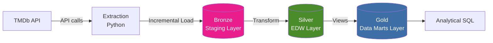
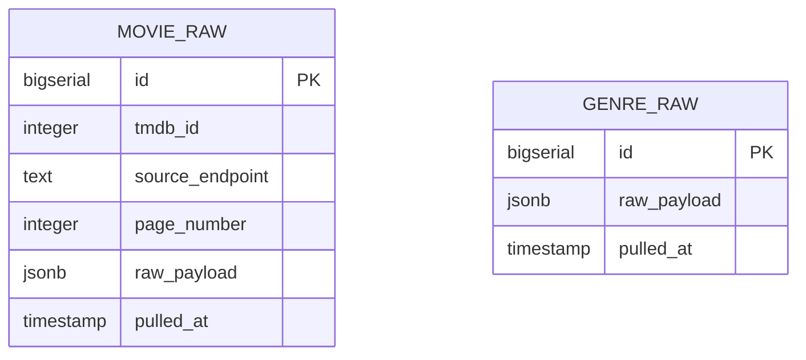
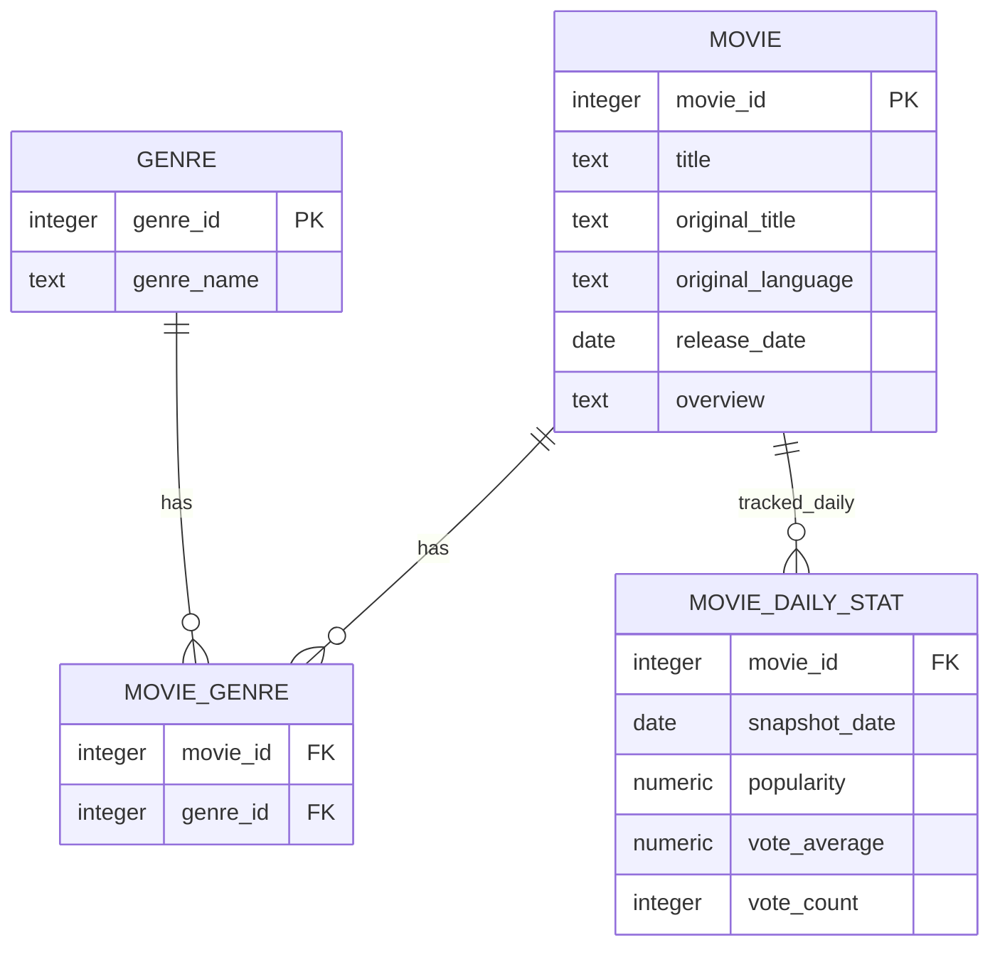
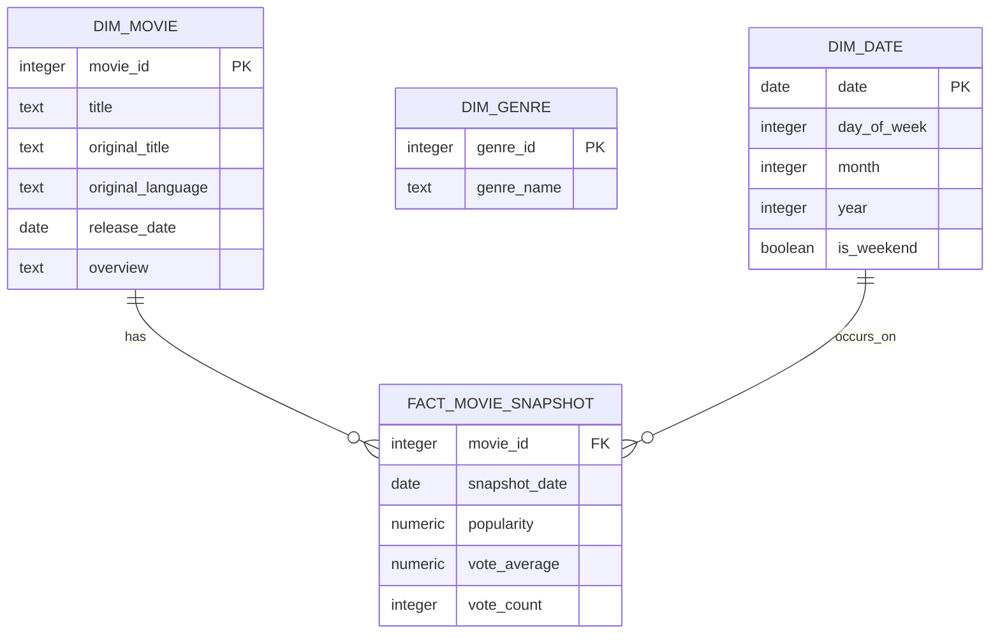

# Movie Data Warehouse

A daily-refreshing, three-layer (Bronze/Silver/Gold) data warehouse built on the Inmon methodology, tracking trending movie data from TMDb. Fully automated via GitHub Actions and running on a cloud-hosted PostgreSQL instance (Neon).

## Project Summary

This project ingests daily trending movie data from The Movie Database (TMDb) API, incrementally loads it into a raw staging layer, transforms it into a normalized enterprise data warehouse, and exposes it through a dimensionally-modeled reporting layer — all running unattended on a daily schedule with zero local infrastructure.

## Architecture



This follows the **Inmon approach**: a normalized enterprise data warehouse (Silver) sits at the center as the single source of truth, with dimensional data marts (Gold) built on top of it for reporting — as opposed to Kimball's bus architecture, which builds conformed dimensional marts directly without a normalized center.

| Layer | Definition | Objective | Load Method | Data Modeling | Audience |
|---|---|---|---|---|---|
| **Bronze** (Staging) | Raw, unprocessed data as-is from source | Traceability & debugging | Incremental (append-only) | None | Data Engineers |
| **Silver** (EDW) | Clean, standardized, normalized data | Prepare data for analysis | Full rebuild from Bronze | Normalized (3NF) | Data Engineers, Analysts |
| **Gold** (Data Marts) | Business-ready data | Reporting & analytics | Views (no physical load) | Star schema | Data Analysts |

## Entity-Relationship Diagrams

### Bronze Layer (Staging)



Bronze is deliberately unstructured — the whole point is a faithful, traceable copy of what the API actually returned, not a cleaned shape.

### Silver Layer (Normalized EDW, 3NF)



Movie attributes (what a movie *is*) are separated from daily stats (how it's *performing*) — this separation is what makes Silver genuinely 3NF rather than just "a cleaned table." The `MOVIE_GENRE` bridge table resolves the many-to-many relationship between movies and genres properly, instead of cramming a genre list into the movie row.

### Gold Layer (Star Schema, exposed as views)



Gold also includes `gold.movie_with_genres`, a flattened reporting view joining movies to an aggregated array of their genre names, for quick lookups without repeated joins.

## Tech Stack

- **Language:** Python (extraction + transformation)
- **Database:** PostgreSQL, hosted on [Neon](https://neon.tech) (serverless, no local infrastructure required)
- **Orchestration:** GitHub Actions (daily scheduled runs + manual trigger support)
- **Data Source:** [TMDb API](https://developer.themoviedb.org/docs) — `movie/popular` and `genre/movie/list` endpoints

## Repository Structure

```
movie-dwh/
├── extraction/
│   └── extract_load.py       # Bronze: pulls from TMDb, loads raw JSON
├── transformation/
│   └── transform_load.py     # Silver: normalizes Bronze into 3NF tables
├── sql/
│   └── gold_analytics.sql    # Gold: star schema views + analytical queries
├── requirements.txt
└── .github/
    └── workflows/
        └── daily_extract.yml # Runs extraction + transformation daily
```

## Setup & Running Locally

1. Clone the repo and install dependencies:
   ```bash
   pip install -r requirements.txt
   ```
2. Set required environment variables:
   ```bash
   export TMDB_API_KEY="your_tmdb_api_key"
   export DATABASE_URL="your_neon_postgres_connection_string"
   ```
3. Create the schema (run once in your Postgres SQL editor):
   ```sql
   CREATE SCHEMA IF NOT EXISTS bronze;
   CREATE SCHEMA IF NOT EXISTS silver;
   CREATE SCHEMA IF NOT EXISTS gold;
   -- then run the CREATE TABLE / CREATE VIEW statements from each layer
   ```
4. Run the pipeline manually:
   ```bash
   python extraction/extract_load.py
   python transformation/transform_load.py
   ```

In production, both scripts run automatically once a day via GitHub Actions (`.github/workflows/daily_extract.yml`), using repository secrets for credentials — no manual steps required.

## Design Decisions

**Why Inmon over Kimball?** Choosing a normalized EDW (Silver) as the trusted center, with dimensional marts (Gold) built on top, gives a clear separation between "single source of truth" and "shaped for reporting." It also mirrors how many real enterprise warehouses are structured, which made it a more useful learning target than jumping straight to a single star schema.

**Why is Bronze incremental but Silver a full rebuild?** Bronze retains complete history via append-only inserts — nothing is ever overwritten, so it's safe to treat as the permanent record. Silver, by contrast, is a *derived* clean state — since Bronze safely holds all history, Silver can be fully recomputed from it on every run without risk of losing data. This keeps the transform logic simple (`INSERT ... ON CONFLICT DO UPDATE`) while still being safely idempotent — re-running it never produces duplicates or inconsistent state.

**Why views for Gold instead of physical tables?** Since Gold's star schema is just a reshaped view of Silver, there's no need for a separate load step — Postgres computes it on query, so Gold is always current the moment Silver updates, with no additional pipeline stage required.

**Why deduplicate by calendar day in Silver?** The extraction script can be triggered manually in addition to its daily schedule (useful for testing), which could create multiple snapshots per movie on the same day. `movie_daily_stat` keeps only the latest snapshot per movie per day, so analytical queries always reflect one clean data point per day regardless of how many times the pipeline happened to run.

## Example Analytical Output

**Genre trend consistency** (from `gold_analytics.sql`, query 3) — average popularity and movie count per genre, tracked daily:

| Genre | Date | Avg Popularity | Movie Count |
|---|---|---|---|
| Horror | 2026-07-12 | 57.73 | 71 |
| Thriller | 2026-07-12 | 49.04 | 112 |
| Animation | 2026-07-12 | 43.33 | 69 |
| Comedy | 2026-07-12 | 41.59 | 120 |
| Western | 2026-07-12 | 17.71 | 5 |

**Popularity volatility** (query 5) — movies with the widest swings in daily popularity so far:

| Movie | Days Tracked | Avg Popularity | Std Dev |
|---|---|---|---|
| Evil Dead Burn | 2 | 99.34 | 31.83 |
| Moana | 2 | 188.33 | 30.72 |
| We Want Now | 2 | 86.36 | 25.83 |

With only a few days of history so far, most movies still show low variance — this metric becomes more meaningful as daily history accumulates.

## What's Next (Phase 2)

A Telegram bot that surfaces daily content from the Gold layer (trending movies, biggest movers, genre highlights) directly to users — turning this from a backend pipeline into a small end-to-end product. See the project plan for scope details.
